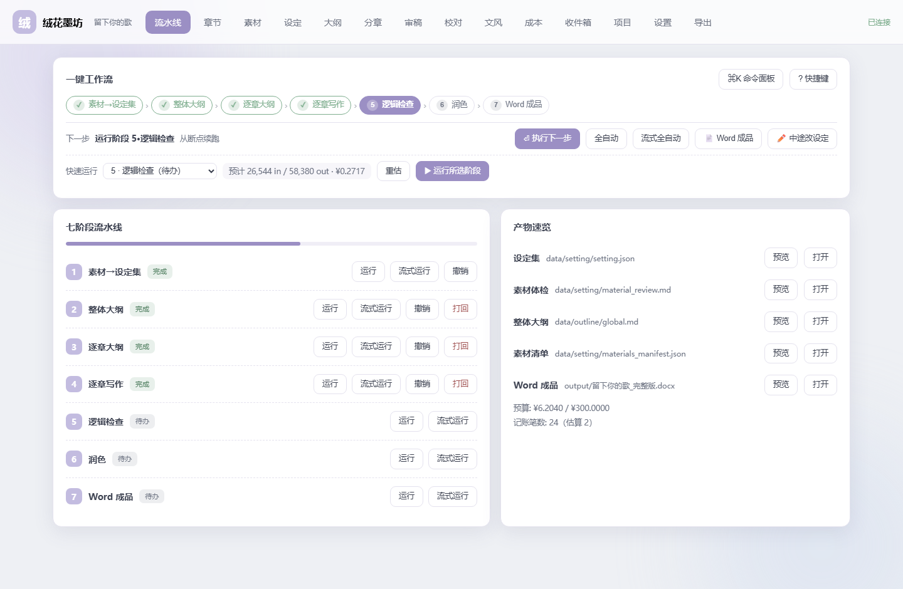
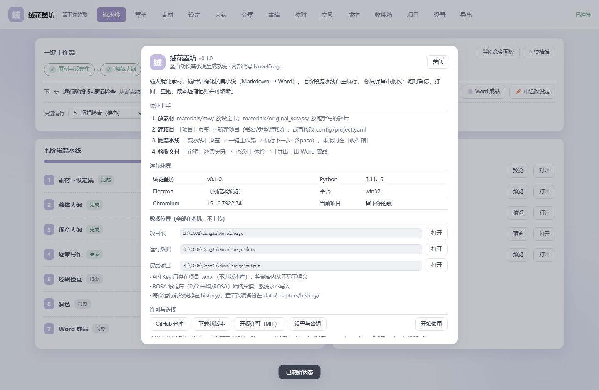

# 绒花墨坊（Ronghua Mofang）

> 全自动长篇小说生成系统 —— 输入混沌素材，输出结构化长篇小说（Markdown → Word）。
> 七阶段流水线自主执行，你只保留审批权：随时暂停、打回、重跑，成本逐笔记账并可熔断。

**对外品牌名：绒花墨坊**（`ronghuamofang`）；`NovelForge` 为早期内部代号（仓库名沿用）。





## 特性

- **七阶段流水线**：素材归并 → 整体大纲 → 逐章大纲 → 逐章写作 → 逻辑检查 → 润色 → Word 成品
- **一键工作流**：步骤条 + 「执行下一步」（`Space`）+ 选阶段费用预估，跑到审批门自动暂停
- **审稿闭环**：章节审查出报告 → 逐条接受/忽略 → 批量精修（改稿前自动备份，字数 ±20% 铁律）
- **校对与文风**：确定性校对（标点/错字/节奏，零 token）+ 文风特征分析与偏差报告
- **断点续跑**：每章落盘 + `progress.json` + SQLite 记账，中断/熔断后从断点继续，不重复花钱
- **成本透明**：逐次调用记账、按阶段/模型聚合、超预算自动熔断
- **模板与代码分离**：提示词在 `prompts/`、Word 版式在 `templates/`，改文件即可，无需改代码
- **本地优先**：素材、大纲、章节、成品全部留在本机；除你自己的模型 API 外不向外发送数据

## 安装与启动

### 方式一：安装包（Windows，推荐）

1. 到 [Releases](https://github.com/MYU46548/ronghuamofang/releases) 下载
   `ronghuamofang-console-setup-x.y.z.exe`（安装版）或 `绒花墨坊-x.y.z-portable-x64.exe`（便携版）
2. 安装并启动「绒花墨坊」
3. 首次启动按向导填书名/类型/章数，然后在「设置」页配置模型 API Key

> 便携版不参与自动更新；安装版启动后会自动检查更新。

### 方式二：源码运行（开发/自定义）

前置：Windows 10/11、Python 3.11、Node.js 20+。

```bash
git clone https://github.com/MYU46548/ronghuamofang.git
cd ronghuamofang
python -m venv .venv
.venv/Scripts/python.exe -m pip install -r requirements.txt
copy .env.example .env        # 填入 TOKENHUB_API_KEY（或你自己的 OpenAI 兼容服务）
cd console && npm install && npm run build && cd ..
```

启动桌面控制台：

```bash
console\启动控制台.bat        # 等价于 console/node_modules/electron/dist/electron.exe . --disable-gpu
```

也可以只用命令行跑管线（见下方「常用命令」）。

## 首次使用（四步）

1. **放素材** —— `materials/raw/` 放设定卡（`.md`）；随手写的碎片丢 `materials/original_scraps/`（自由命名、不进 Git）
2. **建项目** —— 「项目」页签 →「＋ 新建项目」（书名/类型/章数一键创建，自动快照并归档旧项目）
3. **跑流水线** —— 「流水线」页签 →「一键工作流 → 执行下一步」；审批门出现在「收件箱」
4. **验收交付** —— 「审稿」逐条决策 →「校对」体检 →「导出」出 Word 成品

### 控制台快捷键

| 按键 | 作用 |
|------|------|
| `Ctrl + K` | 命令面板（搜索所有操作：运行阶段 / 切页签 / 审稿 / 导出 / 主题） |
| `Space` | 执行下一步 / 停止当前任务 |
| `R` | 刷新状态与成本 |
| `1`–`9`、`0` | 切换页签（流水线/章节/素材/设定/大纲/分章/审稿/校对/文风/收件箱） |
| `?` | 快捷键说明 |
| `Esc` | 关闭当前弹层 |

点左上角 **LOGO** 打开「关于」（版本 / 运行环境 / 数据位置 / 快速上手 / 许可）；
点左侧 **书名** 直达「项目」页签。

## 常用命令

| 操作 | 命令（项目根，用 `.venv` 的 python） |
|------|--------------------------------------|
| 全流程启动（断点续跑） | `python scripts/orchestrator.py` |
| 从阶段 N 重跑 | `python scripts/orchestrator.py --from N` |
| 只跑阶段 N | `python scripts/orchestrator.py --stage N` |
| 审批 / 撤销审批 | `python scripts/approve.py --stage 2 [--revoke]` |
| 打回阶段（清下游+重置） | `python scripts/reject.py --stage N "原因"` |
| 大纲精修（定向修订） | `python scripts/refine_outline.py "意见"` |
| 章节精修 | `python scripts/refine_chapter.py 3 "意见"` |
| 章节审查 / 批量精修 | `python scripts/chapter_review.py` / `python scripts/batch_refine.py --report data/outline/review_report.json` |
| 校对（确定性，零 token） | `python scripts/proofread.py --scope refined` |
| 生成前费用预估 | `python scripts/estimate_tokens.py [--stage 4]` |
| 成本报告 | `python scripts/cost_report.py [--by-chapter]` |
| 多书切换 | `python scripts/switch_book.py --list` / `--archive` / `--restore "书名"` |
| 项目快照 | `python scripts/snapshot.py "标签"` |
| 本地 API 服务 | `python scripts/nf_api.py`（默认 127.0.0.1:8765） |
| 桌面控制台 | `console\启动控制台.bat` |

完整命令表（含全部自检脚本）见 `AGENTS.md`。

## 目录结构

```
NovelForge/
├── console/          # Electron 桌面控制台（main / preload / src + Vite 构建产物）
├── scripts/          # orchestrator.py 主调度 + stage1-7 + nf_api.py + utils/
├── prompts/          # 七阶段提示词模板（可热改）+ reference/ 实战咒语
├── templates/        # Word 版式模板（.dotx / .docx）
├── config/           # system.yaml（模型/预算）+ project.yaml（书名/类型/章数）
├── materials/        # raw/ 结构化素材卡；original_scraps/ 私人碎片（不进 Git）
├── data/             # 运行时数据：setting/outline/chapters/summaries/state（不进 Git）
├── history/          # 版本快照（每阶段成功后自动生成，不进 Git）
├── logs/             # runs.db（运行/章节/成本 SQLite）
├── output/           # 最终交付 *.docx（不进 Git）
├── docs/             # 文档与截图
└── Temp/             # 开发期自检脚本与截图（不进 Git）
```

## 数据与隐私

- 所有创作数据在本机：`data/`（运行产物）、`history/`（快照）、`output/`（成品）
- 模型 API Key 只存 `config/../.env`（`.gitignore` 已屏蔽），控制台内**从不显示明文**，只给掩码
- ROSA 世界观库（`E:/图书馆/ROSA`）在配置中固定为**只读**，系统永不写入
- 除调用你自己配置的模型 API 外，程序不发起任何外部网络请求

## 常见问题

**Q：控制台显示「离线」？**
`nf_api` 子进程没起来。看 `%LOCALAPPDATA%\Temp\nf_api_child.log`，或在控制台内
命令面板 → 「查看运行日志」。

**Q：文档里的模型名/单价不对？**
只改 `config/system.yaml`（`engine` / `model.*` / `providers`），代码零改动；
新增服务商先在 `scripts/utils/cost_tracker.py` 的 `RATES` 补价（可用 `scripts/price_wizard.py` 交互式更新）。

**Q：想换一本书继续写？**
「项目」页签 →「＋ 新建项目」（自动归档当前书），或「恢复」已归档项目。

**Q：改稿怕丢？**
每次精修前自动备份到 `data/chapters/history/`，可在「章节 → 历史」一键回退；
运行前也会自动快照到 `history/`。

## 开发

```bash
cd console && npm run build      # 改前端后必须构建（生产模式加载 renderer/dist）
cd console && npm run dist       # 本地打包（不发布）
```

改动后请跑对应自检（都在 `Temp/`，不进 Git）：

| 自检 | 命令 | 覆盖 |
|------|------|------|
| GUI↔API 契约 | `python Temp/test_gui_api_contract.py` | 前端每个 `api()` 都有同方法后端分支 |
| 真机视觉验收 | `python Temp/e2e_ux_verify.py` | Playwright 点击/按键 + 截图 + console 报错 |
| 项目向导/关于端点 | `python Temp/test_project_wizard_api_http.py` | 新建项目、风格笔记、`/about` |
| UX 端点 | `python Temp/test_ux_flow_api_http.py` | `/stage/skip`、`/logs/tail` |

开发约定、踩坑与阶段语义见 `AGENTS.md`；历次变更见 `开发日志.md`。

## 许可

本体以 [MIT](LICENSE) 发布，© 2026 暮雨（MUYU46548）。
第三方组件许可见 [THIRD-PARTY.md](THIRD-PARTY.md)。
